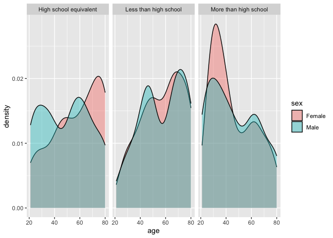

Homework 3
================

Mahitha Jangeti 10/13/25

``` r
library(tidyverse)
```

    ## ── Attaching core tidyverse packages ──────────────────────── tidyverse 2.0.0 ──
    ## ✔ dplyr     1.1.4     ✔ readr     2.1.5
    ## ✔ forcats   1.0.0     ✔ stringr   1.5.1
    ## ✔ ggplot2   3.5.2     ✔ tibble    3.3.0
    ## ✔ lubridate 1.9.4     ✔ tidyr     1.3.1
    ## ✔ purrr     1.1.0     
    ## ── Conflicts ────────────────────────────────────────── tidyverse_conflicts() ──
    ## ✖ dplyr::filter() masks stats::filter()
    ## ✖ dplyr::lag()    masks stats::lag()
    ## ℹ Use the conflicted package (<http://conflicted.r-lib.org/>) to force all conflicts to become errors

## Problem 1

**Loading dataset and creating plot**

``` r
library(p8105.datasets)
data("instacart")

instacart_df = instacart
```

The Instacart dataset displays information on the many online grocery
orders made by instacart users.The dataset contains 1,384,617
observations of 131,209 unique users, where each row in the dataset is a
product from an order. Some key variables include `user_id` which
identifies the orderer, `aisle_id` that identifies the aisle,
`order_dow` which indicates the day of the week on which the order was
placed, `produce_name` which indicates name of the product and
`department` and `aisle` for department and aisle names in which
purchases are broken up into.

``` r
instacart_df %>% 
  group_by(aisle) %>% 
  summarize(n_obs = n()) %>% 
  mutate(aisle_rank = min_rank(desc(n_obs))) %>% 
  arrange(aisle_rank) %>% 
  filter(n_obs > 10000) %>% 
  ggplot(aes(x = aisle, y = n_obs)) +
  geom_col() +
  coord_flip() +
  labs(
    title = "Number of Items Ordered in each Aisle",
    x = "Aisle Name",
    y = "Number of Items Ordered"
  )
```

<!-- -->

There are 134 aisles with most items order from the fresh vegetables,
fresh fruits, and packed vegetables fruits aisles.

**Creating Tables Based on Aisle**

``` r
instacart_df %>% 
  filter(aisle %in% c("baking ingredients")) %>% 
  group_by(aisle, product_name) %>% 
  summarize(n_baking = n()) %>% 
  mutate(baking_rank = min_rank(desc(n_baking))) %>% 
  arrange(baking_rank) %>% 
  filter(baking_rank <= 3) %>% 
knitr::kable()
```

    ## `summarise()` has grouped output by 'aisle'. You can override using the
    ## `.groups` argument.

| aisle              | product_name      | n_baking | baking_rank |
|:-------------------|:------------------|---------:|------------:|
| baking ingredients | Light Brown Sugar |      499 |           1 |
| baking ingredients | Pure Baking Soda  |      387 |           2 |
| baking ingredients | Cane Sugar        |      336 |           3 |

``` r
instacart_df %>% 
  filter(aisle %in% c("dog food care")) %>% 
  group_by(aisle, product_name) %>% 
  summarize(n_dog = n()) %>% 
  mutate(dog_rank = min_rank(desc(n_dog))) %>% 
  arrange(dog_rank) %>% 
  filter(dog_rank <= 3) %>% 
knitr::kable()
```

    ## `summarise()` has grouped output by 'aisle'. You can override using the
    ## `.groups` argument.

| aisle         | product_name                                  | n_dog | dog_rank |
|:--------------|:----------------------------------------------|------:|---------:|
| dog food care | Snack Sticks Chicken & Rice Recipe Dog Treats |    30 |        1 |
| dog food care | Organix Chicken & Brown Rice Recipe           |    28 |        2 |
| dog food care | Small Dog Biscuits                            |    26 |        3 |

``` r
instacart_df %>% 
  filter(aisle %in% c("packaged vegetables fruits")) %>% 
  group_by(aisle, product_name) %>% 
  summarize(n_packaged = n()) %>% 
  mutate(packaged_rank = min_rank(desc(n_packaged))) %>% 
  arrange(packaged_rank) %>% 
  filter(packaged_rank <= 3) %>% 
knitr::kable()
```

    ## `summarise()` has grouped output by 'aisle'. You can override using the
    ## `.groups` argument.

| aisle                      | product_name         | n_packaged | packaged_rank |
|:---------------------------|:---------------------|-----------:|--------------:|
| packaged vegetables fruits | Organic Baby Spinach |       9784 |             1 |
| packaged vegetables fruits | Organic Raspberries  |       5546 |             2 |
| packaged vegetables fruits | Organic Blueberries  |       4966 |             3 |

Top three products in baking ingredients are **light brown sugar, pure
baking soda, and cane sugar**. Top three products in dog food care are
**snack sticks chicken & rice recipe dog treats, organix chicken & brown
rice recipe, and small dog biscuits**. Lastly, the top three products in
packaged vegetables fruits are **organic baby spinach, organic
raspberries, and organic blueberries**.

**Creating Table for Pink Lady Apples and Coffee Ice Cream**

``` r
instacart_df %>% 
  filter(product_name %in% c("Pink Lady Apples", "Coffee Ice Cream")) %>% 
   mutate(
     order_dow = recode(order_dow,
                  `0` = "Monday",
                  `1` = "Tuesday",
                  `2` = "Wednesday",
                  `3` = "Thursday",
                  `4` = "Friday",
                  `5` = "Saturday",
                  `6` = "Sunday")) %>% 
  group_by(product_name, order_dow) %>% 
  rename("Product Name" = product_name) %>% 
  summarize(mean_hour = mean(order_hour_of_day, na.rm = TRUE)) %>% 
  pivot_wider(
    names_from = order_dow,
    values_from = mean_hour
  ) %>% 
  knitr::kable(digits = 1)
```

    ## `summarise()` has grouped output by 'Product Name'. You can override using the
    ## `.groups` argument.

| Product Name     | Friday | Monday | Saturday | Sunday | Thursday | Tuesday | Wednesday |
|:-----------------|-------:|-------:|---------:|-------:|---------:|--------:|----------:|
| Coffee Ice Cream |   15.2 |   13.8 |     12.3 |   13.8 |     15.3 |    14.3 |      15.4 |
| Pink Lady Apples |   11.6 |   13.4 |     12.8 |   11.9 |     14.2 |    11.4 |      11.7 |

## Problem 2

``` r
zori_df = 
  read_csv("./zillow_data/zori.csv", na = c("NA", ".", "")) %>% 
  janitor::clean_names() %>% 
  relocate(county_name) %>% 
  select(-state, county = county_name) %>% 
  mutate(county = county %>% 
            str_replace("New York County", "New York") %>% 
            str_replace("Kings County", "Kings") %>%
            str_replace("Queens County", "Queens") %>%
            str_replace("Bronx County", "Bronx") %>%
            str_replace("Richmond County", "Richmond")) %>% 
  rename(zip_code = region_name) %>% 
  pivot_longer(
    x2015_01_31:x2024_08_31,
    names_to = "date",
    values_to = "zillow observed rent index")
```

    ## Rows: 149 Columns: 125
    ## ── Column specification ────────────────────────────────────────────────────────
    ## Delimiter: ","
    ## chr   (6): RegionType, StateName, State, City, Metro, CountyName
    ## dbl (119): RegionID, SizeRank, RegionName, 2015-01-31, 2015-02-28, 2015-03-3...
    ## 
    ## ℹ Use `spec()` to retrieve the full column specification for this data.
    ## ℹ Specify the column types or set `show_col_types = FALSE` to quiet this message.

``` r
  knitr::kable(head(zori_df, 4))
```

| county | region_id | size_rank | zip_code | region_type | state_name | city | metro | date | zillow observed rent index |
|:---|---:|---:|---:|:---|:---|:---|:---|:---|---:|
| Queens | 62080 | 4 | 11368 | zip | NY | New York | New York-Newark-Jersey City, NY-NJ-PA | x2015_01_31 | NA |
| Queens | 62080 | 4 | 11368 | zip | NY | New York | New York-Newark-Jersey City, NY-NJ-PA | x2015_02_28 | NA |
| Queens | 62080 | 4 | 11368 | zip | NY | New York | New York-Newark-Jersey City, NY-NJ-PA | x2015_03_31 | NA |
| Queens | 62080 | 4 | 11368 | zip | NY | New York | New York-Newark-Jersey City, NY-NJ-PA | x2015_04_30 | NA |

``` r
neighborhood_df = 
  read_csv("./zillow_data/zip_codes.csv", na = c("NA", ".", "")) %>%
  janitor::clean_names() %>% 
  relocate(county, neighborhood)
```

    ## Rows: 322 Columns: 7
    ## ── Column specification ────────────────────────────────────────────────────────
    ## Delimiter: ","
    ## chr (4): County, County Code, File Date, Neighborhood
    ## dbl (3): State FIPS, County FIPS, ZipCode
    ## 
    ## ℹ Use `spec()` to retrieve the full column specification for this data.
    ## ℹ Specify the column types or set `show_col_types = FALSE` to quiet this message.

``` r
  knitr::kable(head(neighborhood_df, 4))
```

| county | neighborhood | state_fips | county_code | county_fips | zip_code | file_date |
|:---|:---|---:|:---|---:|---:|:---|
| Bronx | High Bridge and Morrisania | 36 | 005 | 36005 | 10451 | 7/25/07 |
| Bronx | High Bridge and Morrisania | 36 | 005 | 36005 | 10452 | 7/25/07 |
| Bronx | Central Bronx | 36 | 005 | 36005 | 10453 | 7/25/07 |
| Bronx | Hunts Point and Mott Haven | 36 | 005 | 36005 | 10454 | 7/25/07 |

**Merging Datasets**

``` r
zillow_df = 
  left_join(zori_df, neighborhood_df, by = c("zip_code", "county")) %>%
  janitor::clean_names() %>% 
  relocate(county, neighborhood, zip_code, zillow_observed_rent_index)
  knitr::kable(head(zillow_df, 4))
```

| county | neighborhood | zip_code | zillow_observed_rent_index | region_id | size_rank | region_type | state_name | city | metro | date | state_fips | county_code | county_fips | file_date |
|:---|:---|---:|---:|---:|---:|:---|:---|:---|:---|:---|---:|:---|---:|:---|
| Queens | West Queens | 11368 | NA | 62080 | 4 | zip | NY | New York | New York-Newark-Jersey City, NY-NJ-PA | x2015_01_31 | 36 | 081 | 36081 | 7/25/07 |
| Queens | West Queens | 11368 | NA | 62080 | 4 | zip | NY | New York | New York-Newark-Jersey City, NY-NJ-PA | x2015_02_28 | 36 | 081 | 36081 | 7/25/07 |
| Queens | West Queens | 11368 | NA | 62080 | 4 | zip | NY | New York | New York-Newark-Jersey City, NY-NJ-PA | x2015_03_31 | 36 | 081 | 36081 | 7/25/07 |
| Queens | West Queens | 11368 | NA | 62080 | 4 | zip | NY | New York | New York-Newark-Jersey City, NY-NJ-PA | x2015_04_30 | 36 | 081 | 36081 | 7/25/07 |

**Zip Code Counts**

``` r
zip_counts =
  zillow_df %>% 
  group_by(zip_code) %>% 
  summarize(n_obs = n()) %>% 
  filter(n_obs == 116)

zip_counts2 =
  zillow_df %>% 
  group_by(zip_code) %>% 
  summarize(n_obs = n()) %>% 
  filter(n_obs < 10)
```

**149 zip codes** are observed 116 times and **0** are observed less
than 10 times. Some zip codes appear fewer because they may be secluded
and have a small population. They can also be newer zip codes that
aren’t properly defined leading to less counts.

**Average rental price in each borough and year**

``` r
zillow2_df = 
  zillow_df %>% 
  mutate(
    date = str_remove(date, "^x")) %>% 
  separate(date, into = c("year", "month", "day"), sep = "_") %>% 
  group_by(county, year) %>% 
  summarize(
    mean_zori = mean(zillow_observed_rent_index, na.rm = TRUE),         .groups = "drop"
  ) %>% 
  filter(!is.na(mean_zori)) %>% 
  rename(
    "Borough" = county,
    "Year" = year) %>% 
  pivot_wider(
    names_from = "Borough",
    values_from = mean_zori
  )
  knitr::kable(head(zillow2_df, 8))
```

| Year |    Bronx |    Kings | New York |   Queens | Richmond |
|:-----|---------:|---------:|---------:|---------:|---------:|
| 2015 | 1759.595 | 2492.928 | 3022.042 | 2214.707 |       NA |
| 2016 | 1520.194 | 2520.357 | 3038.818 | 2271.955 |       NA |
| 2017 | 1543.599 | 2545.828 | 3133.848 | 2263.303 |       NA |
| 2018 | 1639.430 | 2547.291 | 3183.703 | 2291.918 |       NA |
| 2019 | 1705.589 | 2630.504 | 3310.408 | 2387.816 |       NA |
| 2020 | 1811.443 | 2555.051 | 3106.517 | 2315.632 | 1977.608 |
| 2021 | 1857.777 | 2549.890 | 3136.632 | 2210.787 | 2045.430 |
| 2022 | 2054.267 | 2868.199 | 3778.375 | 2406.038 | 2147.436 |

The table indicates how average rent price has increased throughout all
boroughs over the years. There are specifically big changes in the New
York and Kings Boroughs. Additionally, New York borough in general has
the most expensive average rental prices while Bronx lies on the lower
range.

**Plot**

## Problem 3

``` r
accelero_df = 
  read_csv("./accelero_data/nhanes_accel.csv", na = c("NA", ".", "")) %>% 
  janitor::clean_names() %>% 
  mutate(
    seqn = as.integer(seqn),  
  )
```

    ## Rows: 250 Columns: 1441
    ## ── Column specification ────────────────────────────────────────────────────────
    ## Delimiter: ","
    ## dbl (1441): SEQN, min1, min2, min3, min4, min5, min6, min7, min8, min9, min1...
    ## 
    ## ℹ Use `spec()` to retrieve the full column specification for this data.
    ## ℹ Specify the column types or set `show_col_types = FALSE` to quiet this message.

``` r
covar_df =
  read_csv("./accelero_data/nhanes_covar.csv", na = c("NA", ".", "")) %>% 
  janitor::clean_names() %>% 
  slice(-1:-4) %>% 
  rename(
    seqn = x1,
    sex = x1_male,
    age = x3,
    bmi = x4,
    education = x1_less_than_high_school
  ) %>% 
   mutate(
    sex = recode(sex, `1` = "Male", `2` = "Female"),
    education = recode(education,
                       `1` = "Less than high school",
                       `2` = "High school equivalent",
                       `3` = "More than high school"),
    seqn = as.integer(seqn),  
    age = readr::parse_number(as.character(age)),
    bmi = readr::parse_number(as.character(bmi))
  ) %>%
  filter(age >= 21) %>%
  drop_na(sex, age, bmi, education) 
```

    ## New names:
    ## Rows: 254 Columns: 5
    ## ── Column specification
    ## ──────────────────────────────────────────────────────── Delimiter: "," chr
    ## (5): ...1, 1 = male, ...3, ...4, 1 = Less than high school
    ## ℹ Use `spec()` to retrieve the full column specification for this data. ℹ
    ## Specify the column types or set `show_col_types = FALSE` to quiet this message.
    ## • `` -> `...1`
    ## • `` -> `...3`
    ## • `` -> `...4`

``` r
nhanes_df = 
  left_join(covar_df, accelero_df, by = "seqn" )
```

**Men and Women in each Education Category**

``` r
education_df = 
nhanes_df %>% 
  group_by(education, sex) %>% 
  summarize(n_hanes = n(), .groups = "drop") %>% 
   pivot_wider(
    names_from = sex,
    values_from = n_hanes
  ) %>% 
  rename(
    "Education" = education)
  knitr::kable(head(education_df, 8))
```

| Education              | Female | Male |
|:-----------------------|-------:|-----:|
| High school equivalent |     23 |   35 |
| Less than high school  |     28 |   27 |
| More than high school  |     59 |   56 |

**Plot for Age Distributions for Men and Women in each Education
Category**

``` r
nhanes_df %>% 
  ggplot(aes(x = age, fill = sex)) +
  geom_density(alpha = .4, adjust = .8) +
  facet_wrap(~ education)
```

<!-- -->

``` r
  labs(
    title = "Age Density by Sex and Education Level",
    x = "Age (years)",
    y = "Density",
    fill = "Sex"
  ) +
  theme_minimal()
```

    ## NULL

Looking at the table, we see the distribution between men and female in
different levels of education is pretty even except for in the high
school equivalent category. In the density plot, we see the distribution
of both sexes across ages in different education categories. Those with
less than high school education tend to be on the older end while those
with more than high school education lean towards younger/middle-age
ranges. Men and women have a broadly similar distribution, however,
women do tend to be on the older end throughout the categories (except
for more than high school education). Specifically women with more than
high school education are generally younger as we can see a high peak.

**Total Activity**

``` r
nhanes_df %>% 
  mutate(total_activity = rowSums(across(min1:min45), na.rm = TRUE)) %>% 
  select(seqn, sex, age, bmi, education, total_activity) %>% 
  ggplot(aes(x = age, y = total_activity, color = sex)) +
  geom_point() +
  geom_smooth(se = FALSE) +
  facet_wrap(~ education) +
  labs(
    title = "Total Daily Activity by Age and Education Level Across Different Sexes",
    x = "Age(years)",
    y = "Total Daily Activity",
    color = "Sex"
  ) +
  theme(legend.position = "bottom")
```

    ## `geom_smooth()` using method = 'loess' and formula = 'y ~ x'

<!-- -->

We can see an overall declining trend in total activity as we approach
an older age in both men and women across the different education
categories. Regarding sex, men tend to have higher total daily activity
than women, except with those in high school equivalent category around
the age of 50.There is more variability in the less than high school
category but sharp declines in activity with aging. Lastly, those with
more than high school education, have more stable total activity with
lower activity comparitively.

**24 Hour Activity Time Courses**

``` r
activity_df =
  nhanes_df %>% 
 pivot_longer(
    cols = starts_with("min"),
    names_to = "minute",
    names_prefix = "min",
    values_to = "activity_time"
  ) %>%  
  mutate(
    minute = as.integer(minute),
    hour = minute/60
  )


activity_df %>% 
  group_by(education, sex, hour) %>% 
  summarize(mean_activity = mean(activity_time, na.rm = TRUE), .groups = "drop") %>% 
  ggplot(aes(x = hour, y = mean_activity, color = sex)) +
  geom_line(alpha = 0.2) +
  geom_smooth(se = FALSE) +
  facet_wrap(~ education, ncol = 1) +
  scale_x_continuous(breaks = seq(0, 24, by = 3)) +
  scale_y_continuous(breaks = seq(0, 20, by = 2)) +
  labs(
    title = "24-Hour Activity Time Course by Sex and Education",
    x = "Hour",
    y = "Mean Activity",
    color = "Sex"
  ) +
  theme_minimal() +
  theme(legend.position = "bottom")
```

    ## `geom_smooth()` using method = 'gam' and formula = 'y ~ s(x, bs = "cs")'

<!-- -->

Across all education levels and genders, activity is lowest during the
end of the day (night) and activity is highest mid day (around 9th-15th
hour). Those with less than high school education slightly have higher
activity for a longer period of time, suggesting more physically
demanding jobs. In men with more than high school education, we are
seeing slightly less mean activity compared to other groups through
different education categories. This may be described by more computer
work. Lastly, we see a sharp decline towards the end of the day
throughout all sexes and education categories.
